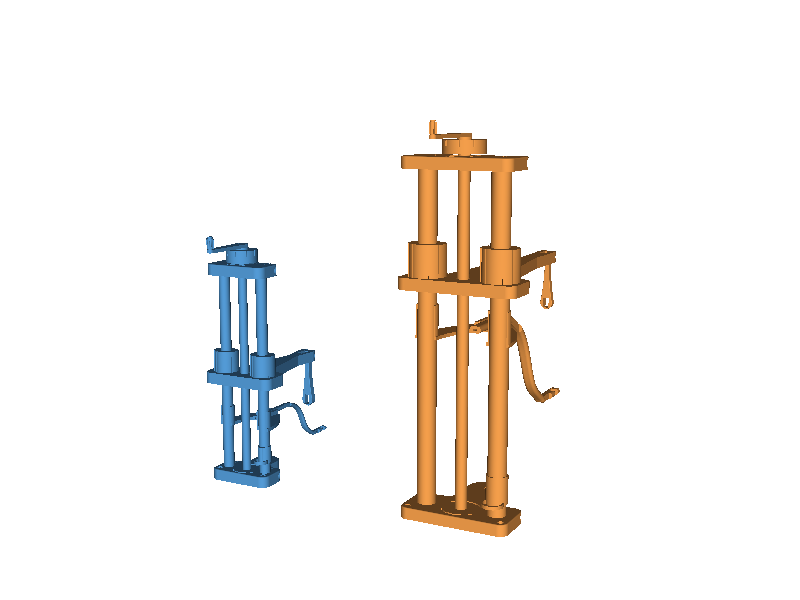

# A tap-testing rig that fits your instrument



*The same rig, printed for a violin (left) and a bass viol (right). Nothing was
redrawn — you tell it the instrument's dimensions and every part follows.*

---

This is [Luca Jost's General Acoustic Measurement Setup][upstream] rebuilt so
that it scales. His rig is a lovely piece of design: a printed column with a
sliding arm, a pendulum hammer that taps the belly at the same speed every
time, and a microphone on a curved arm beside the ribs. It is dimensioned for a
violin.

If you work on violas da gamba, cellos, or anything else with deeper ribs and a
wider lower bout, those dimensions do not fit. This version asks you for the
instrument instead:

```
body length 660    ribs 125    lower bout 380
```

and works out the rest — how far the arm must reach, how high the tap point
sits, how tall the column needs to be, and whether 10 mm guide rods are still
stiff enough (for a bass viol, they are not; it moves to 16 mm).

## What you get

Eleven printable parts, as STL and STEP, for whichever instrument you name.
Plus the whole rig assembled as a single STEP file so you can look it over
before spending a weekend printing.

## Which instrument?

| preset | body | ribs | lower bout | tap point | reach | rods | column |
|---|---|---|---|---|---|---|---|
| `violin` | 355 | 30 | 208 | 45 up | 106 out | 10 mm | 200 |
| `viola` | 410 | 34 | 240 | 50 | 122 | 12 mm | 200 |
| `treble viol` | 370 | 62 | 230 | 80 | 117 | 10 mm | 250 |
| `tenor viol` | 490 | 88 | 290 | 108 | 147 | 12 mm | 250 |
| `bass viol` | 660 | 125 | 380 | 147 | 192 | 16 mm | 300 |
| `cello` | 755 | 114 | 440 | 139 | 222 | 16 mm | 300 |

All dimensions in mm. **The `violin` preset reproduces Luca Jost's original
rig** — every part is within 1.9% of his by volume, and the mating dimensions
(bores, bearing seats, bolt positions) are identical. If you want his rig,
print that and you have it.

The viol figures are mid-range for surviving consort instruments, which vary
far more than the violin family does. If yours differs, say so — see
[Changing the numbers](#changing-the-numbers).

### One rig for more than one instrument

A bass viol and a cello want **the same rig**: same 16 mm rods, same M10
leadscrew, same 300 mm column, same plates and carriage. They differ in exactly
one thing the assembled rig cannot already adjust — 30 mm of hammer reach.
Everything else is a setting: tap height is the crank, the microphone arm
slides in its fins, and the holder clips anywhere on the rods.

So build one, and give the arm a pivot hole for each:

```bash
.venv/bin/python tools/export_all.py "bass viol+cello"
```

The arm comes out long enough for the cello with pivot holes at 192 mm and
222 mm. Move the hammer pin, wind the crank, and the head lands on the belly of
whichever instrument is on the bench. You get one assembly file per position so
you can check both before printing. Its bill of materials is
[BOM.md](BOM.md).

Any combination works — `"viola+treble viol"`, or all six if you want one rig
that does everything (though at that point the arm is long and the violin
deserves better).

## Making one

You need [uv](https://github.com/astral-sh/uv) (or any Python 3.10+ with pip).

```bash
git clone https://github.com/pzfreo/viol-measuring
cd viol-measuring
uv venv --python 3.12 .venv
uv pip install --python .venv/bin/python build123d numpy

.venv/bin/python tools/export_all.py "bass viol"
```

That writes every part plus the assembly into `export/bass_viol/`, and prints
the rig's key dimensions so you can sanity-check them against your instrument
before printing. Use any preset name from the table; `violin` is the default.

Everything prints without support — the cross-bolt holes are teardrop-shaped
for exactly that reason, and the parts are oriented so their flats are the
build surface.

## What to buy

**There is a full bill of materials for the bass viol / cello rig in
[BOM.md](BOM.md)** — printed masses, exact bolt lengths, bearing designations
and print orientations, all generated from the model so it cannot drift from
the geometry. Regenerate it for any other instrument with:

```bash
.venv/bin/python tools/make_bom.py "tenor viol"
```

The bought-in parts are Luca Jost's [original list][upstream] — two aluminium
guide rods, a threaded rod, linear bearings, two 608 bearings, M4 hardware,
electret microphones and a Behringer UCA-202. His README has purchase links.

For the larger presets, three things change and you should check before
ordering:

- **guide rods** — 12 mm for viola and tenor viol, **16 mm for bass viol and
  cello**, with matching linear bearings
- **leadscrew** — M10 rather than M8 above the violin, and a longer one
- **rod length** — 250 or 300 mm rather than 200

The exported summary prints all of these. The 608 thrust bearings and the M4
clamp hardware are unchanged throughout.

## Three things worth knowing before you measure

**Bolt it down.** The three counterbored holes in the base are not feet — they
take M3 screws into a board. Free-standing, the violin rig tips under about
48 g applied to the end of the arm and the bass viol under 123 g; that is a
hand resting on it. This is true of the original rig too, not something the
larger sizes introduced. Bolted to a board it is not close: 1 kg on the arm tip
puts around 6 N of uplift on each rear screw.

**Check your frequency range.** The measurement template that ships with the
original (`ref/upstream/GMS_template.txt`) plots from 200 Hz. A cello's A0 air
mode sits at roughly 93–120 Hz, and a bass viol's will be similar — *below the
bottom of the default plot*. The single most diagnostic low mode would not be
on screen. The 0.3 s sample window is also coarse for a sharp air mode. Both
want changing for anything larger than a viola.

**This is not a free-free measurement.** The rig lays the instrument on its
back on the bench. Modal work normally supports the instrument on foam or hangs
it on elastic, precisely to avoid the bench damping it. For a violin the
difference is small; for a cello-sized instrument resting its ribs on a bench
it is proportionally larger. Worth one controlled comparison before trusting
absolute numbers at the large end.

There is also no published rig at this size to check against — Joseph Curtin's
[Impulse Measurement Rig][curtin-rig], the reference instrument in this field,
covers *"violins and violas of any size"* and does not do cellos. Treat the
large presets as a starting point, not a settled design.

## Changing the numbers

If your instrument is not one of the presets, or you have measured your own,
one line does it:

```python
from gams import Instrument, Rig

my_viol = Instrument("my bass", body_length=680, rib_depth=132,
                     arching=24, lower_bout=395)

print(Rig(my_viol).summary())
```

That prints the rig it implies. Everything else — reach, tap height, column
height, rod diameter, arm section — follows from those four numbers.

The individual fits are adjustable too, if your printer runs tight or loose.
The one that matters most is the slot the microphone arm slides in: the
original ships the arm in ±0.05, ±0.10 and ±0.15 mm widths for exactly this
reason. Here it is a single number (`fits.arm_slot`, default 0.06 mm) rather
than four separate models.

## Where this departs from the original

The violin preset reproduces Luca Jost's rig. Everything below is a place where
this rebuild is *not* simply his design, and you should know about all of it
before printing.

**The two M4 grub screws are not modelled, and I do not know where they go.**
Luca Jost's build video has them threaded into the slider after the linear
bearings, tightened so they cannot work loose. I have not found a hole for
them: the bearing tube walls are solid at every height, and the one
screw-sized bore in the slider is the cable channel from the arm. An
unresolved gap, not a finding that they are unnecessary. See [BOM.md](BOM.md).

**The knob's knurl and the sleeve's knurl are approximations.** Both are the
right kind of feature in the right place and to the right depth — nine broad
scallops on the knob, a crossed-helix diamond on the sleeve — but I could not
work out the exact construction of either. The knob's flute profile matches his
to 0.24 mm and the sleeve's pattern drifts along its height.

**The top plate has one local mismatch** of 1.5 mm, in a part whose surface
otherwise agrees to 0.07 mm over 95% of itself. I have not tracked down which
feature it is.

**Above violin size, the scaling rules are mine.** Which rod diameter to step
up to and when, how the arm section grows with reach, how the microphone arm's
bend stretches — none of that is in his design, because his design is for a
violin. **None of the larger presets has been printed or used.** They are a
considered starting point, not a proven rig. His violin rig is the proven one.

## How faithful is it?

Every part was measured back off Luca Jost's mesh files and rebuilt to match,
then checked against them:

| part | vs original | | part | vs original |
|---|---|---|---|---|
| Base | −0.17% | | Hammer | −0.14% |
| Top | +0.24% | | Knob | +0.44% |
| Slider | −0.07% | | Knob handle | +0.03% |
| Microphone holder | +0.04% | | Knurl | +0.54% |
| Microphone arm | +0.58% | | Handheld hammer | −0.16% |
| Cable clip | +0.06% | | | |

Worst case 0.6% by volume — but volume is a weak test, because two errors can
cancel in it. Each part also has a generated geometric-equivalence suite in
`tests/fingerprint/`, comparing surface area, centre of mass, the full inertia
tensor and point-by-point surface deviation against an embedded copy of his
mesh. Run `python tools/report.py` for the numbers. Eight of the eleven agree
on every one of those; the three that do not are named above. More usefully still, the *fits* are asserted by tests: the
crank socket clears the knob post, the grip spins on its pin but cannot come
off, the hammer swings free in the slider's fork, the bearing bores are a
zero-clearance press fit on a 19 mm LM10UU, and no two parts interfere when
assembled.

Some of what came out of that measurement is genuinely nice design that is
worth knowing about if you build one:

- The **bearing seat** in the base and top is not a round pocket. It is a disc
  flatted to exactly 22.0 mm across, so the two flats locate the 608 bearing —
  far easier to print to size than a circular bore.
- The **microphone arm** is a closed box — a rounded rectangle with an obround
  channel inside it — with three short windows cut in one side. You lay the
  cable in through the windows; the box stays closed through the S-bend, where
  an open section would be far softer in twist. The windows are spaced along
  the arm rather than along its reach, so the middle one, on the steepest part
  of the bend, spans barely 2 mm of reach for its 10 mm of arm.
- The **hammer's outline is three arcs**: a 12 mm round head, a 5 mm round
  tail, and a 200 mm arc tangent to both. Not a taper, not a spline — three
  radii, and they fit his mesh to two microns.
- Both plates **relieve the thrust bearing's inner race**, stepping the bore
  22 → 12 → 9 mm. Skip that relief and the plate bears on the race the
  leadscrew turns in, which loads the balls sideways and stiffens the crank.
- The **cable enters the slider through a 15° cone** in the carriage's front
  face, so the lead is led in rather than chafed on an edge.
- The **holder's arch is two very large arcs**, R54.7 outside and R45.4 in,
  struck from centres out on the rod axis and meeting at a rounded point. Its
  fins are filleted into the plate on the outside only — a fillet on the slot
  side would foul the arm it is there to guide.
- The **holder's fins grip the arm, not the microphone.** Sliding the arm is
  how you set the microphone's position.

## Sources and further reading

If you are new to this, start with Gough — it is the clearest overview of what
you are actually measuring and why.

**Violin family acoustics**

- Colin Gough, [*Violin Acoustics*][gough-at], Acoustics Today (2016) —
  [PDF][gough-pdf], [supplementary text][gough-supp], [media][gough-media]
- Colin Gough, [*Violin acoustics: an introduction and recent
  developments*][gough-musica] (MusICA seminar); his site: [colingough.com][gough-site]
- Jim Woodhouse, [*Euphonics: the science of musical
  instruments*][euphonics] — the online reference work; see especially
  [signature modes and formants][euphonics-modes] and [experimental modal
  analysis][euphonics-ema]
- George Bissinger's papers and the Strad3D datasets: [strad3d.org][strad3d]
- [Modal analysis of violins and cellos][asa-cello], Acoustical Society of
  America — one of the few sources giving cello mode frequencies

**Measurement practice**

- [VSA-Oberlin Acoustics Workshop][oberlin] and its
  [YouTube channel][oberlin-yt] — the annual gathering where most of this is
  worked out
- Joseph Curtin, [Impulse Measurement Rig][curtin-rig] — the commercial
  reference rig; useful for what it specifies (a few-gram impulse hammer, an
  omnidirectional condenser mic, meaningful data to 7 kHz)
- [ObiApp][obiapp], the free analysis software by Chris Rogers and Joseph
  Curtin that goes with it
- George Stoppani's [modal analysis software][stoppani] — acquisition, mode
  fitting, mode shapes and animation; widely used by makers
- Martin Schleske on [modal analysis][schleske] and [sound analysis
  method][schleske-method]
- [Support conditions for free boundary-condition modal testing][free-free] —
  why foam and elastic suspension are the norm

There is more detail, including the numbers behind the frequency-range warning
above, in [`REFERENCE.md`](REFERENCE.md).

## Credit

The design is **Luca Jost's**. The column, the pendulum hammer, the sliding
arm, the curved microphone arm, the split clamps, the choice of hardware — all
of it is his, and it is a genuinely good piece of design that repaid careful
measurement. This repository only re-expresses it as parameters so it can be
made larger.

His original: [luca-jost-violins/General-Acoustic-Measurement-Setup][upstream].
Please start there, and use his README for the parts list and purchase links.

## Licence

MIT, matching the original. See [LICENSE](LICENSE).

*(A note for Luca, if you find this: the `LICENSE` in your repository still has
the placeholder `[year] [fullname]` where the copyright line should be — that
is [issue #1][upstream-issue] on your repo. Filling it in would make it easier
for people to build on your work with confidence.)*

[upstream]: https://github.com/luca-jost-violins/General-Acoustic-Measurement-Setup
[upstream-issue]: https://github.com/luca-jost-violins/General-Acoustic-Measurement-Setup/issues/1
[gough-at]: https://acousticstoday.org/violin-acoustics-colin-e-gough/
[gough-pdf]: https://acousticstoday.org/wp-content/uploads/2016/06/Gough.pdf
[gough-supp]: https://acousticstoday.org/supplementary-text-violinacoustics-colin-e-gough/
[gough-media]: https://acousticstoday.org/violin-acoustics-media/
[gough-musica]: https://www.musica.ed.ac.uk/archive/2017/colin-gough/
[gough-site]: http://colingough.com/
[euphonics]: https://euphonics.org/
[euphonics-modes]: https://euphonics.org/5-3-signature-modes-and-formants/
[euphonics-ema]: https://euphonics.org/10-5-experimental-modal-analysis/
[strad3d]: https://strad3d.org/articles.html
[asa-cello]: https://acoustics.org/pressroom/httpdocs/135th/rossing.htm
[oberlin]: https://josephcurtinstudios.com/research/oberlin-workshop/
[oberlin-yt]: https://www.youtube.com/@oberlinacousticsworkshop9137
[curtin-rig]: https://josephcurtinstudios.com/research/measurement-rig/
[obiapp]: https://sites.google.com/view/oberlinacoustics/home
[stoppani]: http://www.stoppani.co.uk/Technical.htm
[schleske]: https://www.schleske.de/en/research/introduction-violin-acoustics/modal-analysis.html
[schleske-method]: https://www.schleske.de/en/research/introduction-violin-acoustics/sound-analysis/method.html
[free-free]: https://www.osti.gov/servlets/purl/1266149
